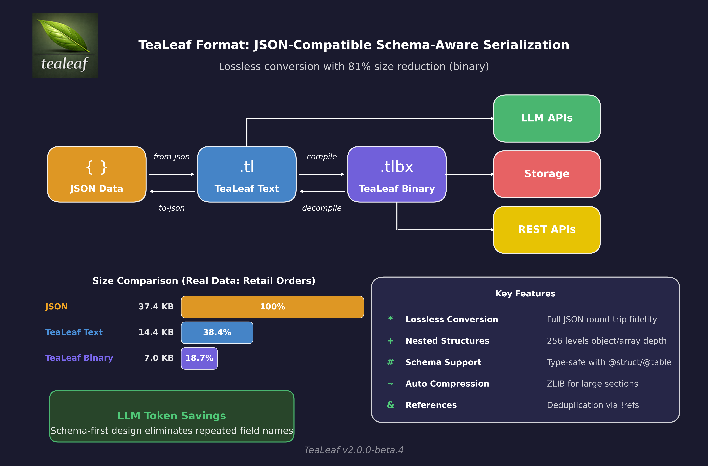
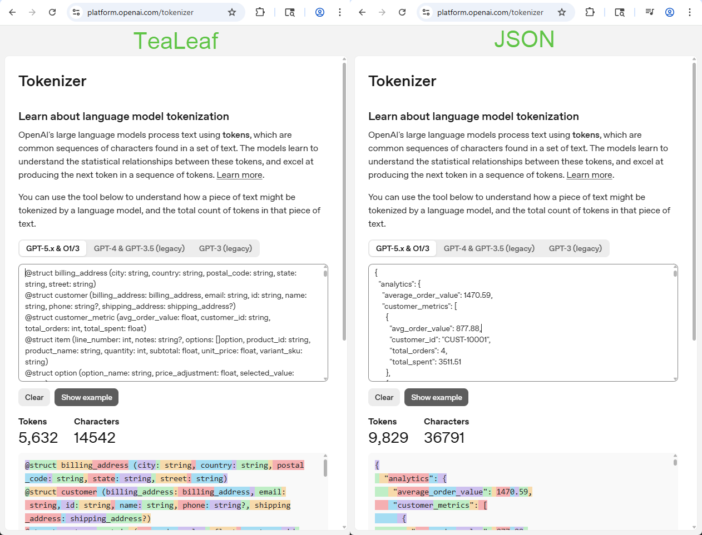

# TeaLeaf Data Format

[](https://github.com/krishjag/tealeaf/actions/workflows/rust-cli.yml)
[](https://github.com/krishjag/tealeaf/actions/workflows/dotnet-package.yml)
[](https://crates.io/crates/tealeaf-core)
[](https://www.nuget.org/packages/TeaLeaf)
[](https://codecov.io/gh/krishjag/tealeaf)
[](LICENSE)

**A schema-aware data format with human-readable text and compact binary representation.**

**~43% fewer input tokens than JSON for LLM applications, with zero accuracy loss.**



---

## Table of Contents

- [Overview](#overview)
  - [Motivation](#motivation)
  - [Quick Compare: JSON vs TeaLeaf](#quick-compare-json-vs-tealeaf)
  - [Workflow Real Example](#workflow-real-example)
- [Installation](#installation)
- [CLI](#cli)
- [Language Bindings](#language-bindings)
- [Design Rationale](#design-rationale)
  - [Size Comparison](#size-comparison)
- [Use Cases](#use-cases)
  - [Context Engineering (LLM/AI)](#context-engineering-llmai)
  - [Other Use Cases](#other-use-cases)
- [Specification](#specification)

---

## Overview

TeaLeaf is a data format that combines:
- **Human-readable text** (`.tl`) for editing and version control
- **Compact binary** (`.tlbx`) for storage and transmission
- **Inline schemas** for validation and compression
- **JSON interoperability** for easy integration


### Motivation

The existing data format landscape presents trade-offs that TeaLeaf attempts to bridge. TeaLeaf does not attempt to replace any of the formats listed below, but rather presents a different perspective that users can objectively compare to identify if it fits their specific use cases.

| Format | Observation |
|--------|-------------|
| JSON | Verbose, no comments, no schema |
| YAML | Indentation-sensitive, error-prone at scale |
| Protobuf | Schema external, binary-only, requires codegen |
| Avro | Schema embedded but not human-readable |
| CSV/TSV/TOON | Too simple for nested or typed data |
| MessagePack/CBOR | Compact but schemaless |

Converting some formats to binary yielded marginal benefits. Schema information was almost always external, requiring coordination between files.

TeaLeaf was designed to unify these concerns: a single file that humans can read and edit, that compiles to an efficient binary, with schemas inline rather than external. Though the format is general-purpose, LLM-Context Engineering uses cases can take advantage of significant token efficiency compared to JSON.

### Quick Compare: JSON vs TeaLeaf

The same data — TeaLeaf uses **schemas** so field names are defined once, not repeated per record:

<table>
<tr>
<th>TeaLeaf (schemas with nested structures)</th>
<th>JSON (no schema, names repeated)</th>
</tr>
<tr>
<td valign="top">

```tl
# Schema: define structure once
@struct Location (city: string, country: string)
@struct Department (name: string, location: Location)
@struct Employee (
  id: int,
  name: string,
  role: string,
  department: Department,
  skills: []string,
)

# Data: field names not repeated
employees: @table Employee [
  (1, "Alice", "Engineer",
    ("Platform", ("Seattle", "USA")),
    ["rust", "python"])
  (2, "Bob", "Designer",
    ("Product", ("Austin", "USA")),
    ["figma", "css"])
  (3, "Carol", "Manager",
    ("Platform", ("Seattle", "USA")),
    ["leadership", "agile"])
]
```

</td>
<td valign="top">

```json
{
  "employees": [
    {
      "id": 1,
      "name": "Alice",
      "role": "Engineer",
      "department": {
        "name": "Platform",
        "location": {
          "city": "Seattle",
          "country": "USA"
        }
      },
      "skills": ["rust", "python"]
    },
    {
      "id": 2,
      "name": "Bob",
      "role": "Designer",
      "department": {
        "name": "Product",
        "location": {
          "city": "Austin",
          "country": "USA"
        }
      },
      "skills": ["figma", "css"]
    },
    {
      "id": 3,
      "name": "Carol",
      "role": "Manager",
      "department": {
        "name": "Platform",
        "location": {
          "city": "Seattle",
          "country": "USA"
        }
      },
      "skills": ["leadership", "agile"]
    }
  ]
}
```

</td>
</tr>
</table>

**Why This Matters:**

| Aspect | JSON | TeaLeaf |
|--------|------|---------|
| Field names | Repeated for every record | Defined once in schema |
| Types | Implicit, inferred at runtime | Explicit in schema, structural checks at parse |
| Binary size | Large (names + values) | Compact (positional data only) |
| LLM tokens | 9,829 tokens (retail example shown below) | 5,632 tokens (**43% fewer**) |
| Validation | External tools needed | Field count validation via schema |

The schema approach means:
- **Text format** is human-readable with explicit types
- **Binary format** stores only values (field names in schema table)
- **String deduplication** — "Seattle", "USA", "Platform" stored once, referenced by index

### Workflow Real Example

A complete retail orders dataset demonstrating the full TeaLeaf workflow:

```
┌─────────────────────────────────────────────────────────────────────────────┐
│                           RETAIL ORDERS WORKFLOW                            │
├─────────────────────────────────────────────────────────────────────────────┤
│                                                                             │
│   retail_orders.json ──────► retail_orders.tl ───────► retail_orders.tlbx   │
│        36.8 KB       from-json     14.5 KB     compile       6.9 KB         │
│      9,829 tokens                5,632 tokens (43% fewer)                   │
│                                                                             │
│   • 10 orders            • 11 schemas defined      • 81% size reduction     │
│   • 4 products           • Human-readable          • 43% fewer LLM tokens   │
│   • 3 customers          • Comments & formatting   • Fast transmission      │
│                                                                             │
├─────────────────────────────────────────────────────────────────────────────┤
│                              LLM ANALYSIS                                   │
├─────────────────────────────────────────────────────────────────────────────┤
│                                                                             │
│   test_retail_analysis.ps1                                                  │
│         │                                                                   │
│         ▼                                                                   │
│   Anthropic API (retail_orders.tl) ──────► responses/retail_analysis.tl     │
│                                                                             │
│   • Sends TeaLeaf-formatted order data  • Business intelligence insights    │
│   • Schema-first = fewer tokens         • Revenue analysis                  │
│   • Structured prompts                  • Customer segmentation             │
│                                                                             │
└─────────────────────────────────────────────────────────────────────────────┘
```

**Try it yourself:**

| File | Description |
|------|-------------|
| [`examples/retail_orders.json`](examples/retail_orders.json) | Original JSON (36.8 KB, 9,829 tokens) |
| [`examples/retail_orders.tl`](examples/retail_orders.tl) | TeaLeaf text format (14.5 KB, 5,632 tokens) |
| [`examples/retail_orders.tlbx`](examples/retail_orders.tlbx) | TeaLeaf binary (6.9 KB) |
| [`examples/test_retail_analysis.ps1`](examples/test_retail_analysis.ps1) | Send to Anthropic API |
| [`examples/responses/retail_analysis.tl`](examples/responses/retail_analysis.tl) | Anthropics's analysis |

---



## Installation

### Pre-built Binaries

Download the latest release from [GitHub Releases](https://github.com/krishjag/tealeaf/releases/latest).

| Platform | Architecture | Download |
|----------|-------------|----------|
| Windows | x64 | [tealeaf-windows-x64.zip](https://github.com/krishjag/tealeaf/releases/latest/download/tealeaf-windows-x64.zip) |
| Windows | ARM64 | [tealeaf-windows-arm64.zip](https://github.com/krishjag/tealeaf/releases/latest/download/tealeaf-windows-arm64.zip) |
| Linux | x64 | [tealeaf-linux-x64.tar.gz](https://github.com/krishjag/tealeaf/releases/latest/download/tealeaf-linux-x64.tar.gz) |
| Linux | ARM64 | [tealeaf-linux-arm64.tar.gz](https://github.com/krishjag/tealeaf/releases/latest/download/tealeaf-linux-arm64.tar.gz) |
| Linux (musl) | x64 | [tealeaf-linux-musl-x64.tar.gz](https://github.com/krishjag/tealeaf/releases/latest/download/tealeaf-linux-musl-x64.tar.gz) |
| macOS | x64 (Intel) | [tealeaf-macos-x64.tar.gz](https://github.com/krishjag/tealeaf/releases/latest/download/tealeaf-macos-x64.tar.gz) |
| macOS | ARM64 (Apple Silicon) | [tealeaf-macos-arm64.tar.gz](https://github.com/krishjag/tealeaf/releases/latest/download/tealeaf-macos-arm64.tar.gz) |

### Quick Install

**Windows (PowerShell):**
```powershell
# Download and extract to current directory
Invoke-WebRequest -Uri "https://github.com/krishjag/tealeaf/releases/latest/download/tealeaf-windows-x64.zip" -OutFile tealeaf.zip
Expand-Archive tealeaf.zip -DestinationPath .

# Optional: add to PATH
$env:PATH += ";$PWD"
```

**Linux/macOS:**
```bash
# Download and extract (replace with your platform)
curl -LO https://github.com/krishjag/tealeaf/releases/latest/download/tealeaf-linux-x64.tar.gz
tar -xzf tealeaf-linux-x64.tar.gz

# Optional: move to PATH
sudo mv tealeaf /usr/local/bin/
```

### Build from Source

Requires [Rust toolchain](https://rustup.rs):

```bash
git clone https://github.com/krishjag/tealeaf.git
cd tealeaf
cargo build --release --package tealeaf-core
# Binary at: target/release/tealeaf (or tealeaf.exe on Windows)
```

### Verify Installation

```bash
tealeaf --version
tealeaf help
```

---

## CLI

```bash
tealeaf <command> [options]

Commands:
  compile       Compile text (.tl) to binary (.tlbx)
  decompile     Decompile binary (.tlbx) to text (.tl)
  info          Show file info (auto-detects format)
  validate      Validate text format syntax
  to-json       Convert TeaLeaf text to JSON
  from-json     Convert JSON to TeaLeaf text
  tlbx-to-json  Convert TeaLeaf binary to JSON
  json-to-tlbx  Convert JSON to TeaLeaf binary
  completions   Generate shell completions
```

Run `tealeaf help <command>` for detailed usage. Shell completions are available for Bash, Zsh, Fish, PowerShell, and Elvish via `tealeaf completions <shell>`.

---

## Language Bindings

| Language | Type | Package |
|----------|------|---------|
| **Rust** | Native | `tealeaf-core` crate |
| **.NET** | FFI | `TeaLeaf` NuGet package |

Both bindings provide:
- Parse text (`.tl`) and read binary (`.tlbx`)
- Dynamic key-based value access
- Schema introspection at runtime
- JSON conversion (bidirectional)
- Memory-mapped reading for large files

Community contributions welcome for Python, Java, and other languages.

---

## Design Rationale

TeaLeaf combines ideas from several formats: human-readable text like JSON/YAML, schema-embedded binaries like Avro, and positional encoding like Protobuf. The key difference is that TeaLeaf keeps schemas inline with data in the text format, making `.tl` files self-documenting and git-friendly.

The binary format (`.tlbx`) embeds schemas, enabling readers to decode files without external `.proto` or `.avsc` files. No code generation is required—schemas are discovered at runtime.

| Feature | JSON | Protobuf | Avro | MsgPack | TeaLeaf |
|---------|------|----------|------|---------|---------|
| Human-readable data format | ✅ | ⚠️* | ❌ | ❌ | ✅ |
| Compact binary | ❌ | ✅ | ✅ | ✅ | ✅ |
| Schema embedded in binary | ❌ | ❌ | ✅ | ❌ | ✅ |
| No code generation required | ✅ | ❌ | ⚠️** | ✅ | ✅ |
| Comments in source | ❌ | N/A | N/A | ❌ | ✅ |
| Built-in JSON conversion | — | ❌ | ❌ | ❌ | ✅ |
| Built-in compression | ❌ | ❌ | ✅ | ❌ | ✅ |

*Protobuf TextFormat exists but is rarely used. **Avro supports GenericRecord but codegen is typical.

---

### Size Comparison

*Data from `cargo run --example size_report` on tealeaf-core.*

| Format | Small Object | 10K Points | 1K Users |
|--------|--------------|------------|----------|
| JSON | 1.00x | 1.00x | 1.00x |
| Protobuf | 0.38x | 0.65x | 0.41x |
| MessagePack | 0.35x | 0.63x | 0.38x |
| TeaLeaf Text | 1.38x | 0.87x | 0.63x |
| **TeaLeaf Compressed** | 3.56x | **0.15x** | 0.47x |

TeaLeaf has 64-byte header overhead (bad for small objects). For large arrays with compression, TeaLeaf achieves **6-7x better compression** than JSON.

**Trade-off:** TeaLeaf decode is ~2-5x slower than Protobuf due to dynamic key-based access. Choose TeaLeaf when size matters more than decode speed.

---

## Use Cases

### Context Engineering (LLM/AI)

TeaLeaf is well-suited for assembling and managing context for large language models

**Why TeaLeaf for LLM context:**
- **~42% fewer input tokens** on real-world data (SEC EDGAR 10-K filings); **~30%** on synthetic benchmarks — verified across Claude Sonnet 4.5 and GPT-5.2
- **Zero accuracy loss** — <a href="accuracy-benchmark/README.md" target="_blank">three-format benchmark</a> (TeaLeaf vs JSON vs TOON) scores within noise across all providers
- Binary format for fast cached context retrieval
- String deduplication (roles, tool names stored once)
- Human-readable text for prompt authoring

**Three-format comparison (real-world SEC EDGAR data, Claude Sonnet 4.5 + GPT-5.2):**

| Metric | TeaLeaf | JSON | TOON |
|--------|---------|------|------|
| Anthropic accuracy | 0.952 | 0.960 | 0.935 |
| OpenAI accuracy | 0.927 | 0.933 | 0.886 |
| Input token savings | **-43%** | baseline | **-43%** |

### Other Use Cases

- **Configuration files** — Human-editable text, compile to binary for deployment
- **API data exchange** — Bidirectional JSON conversion
- **Scientific/tabular data** — Null bitmap optimization for sparse data
- **Embedded/IoT** — Memory-mapped reads, no parsing allocations

---

## Specification

For the complete technical specification including text format syntax, type system, binary format details, and grammar, see:

<a href="spec/TEALEAF_SPEC.md" target="_blank">TeaLeaf Spec</a>

---

## Roadmap

Planned improvements and areas where contributions are welcome.

See [CONTRIBUTING.md](CONTRIBUTING.md) for current development guidelines and how to get involved.

### Language Bindings

The FFI layer (`tealeaf-ffi`) exposes a C-compatible API, making bindings straightforward for any language with C interop. Currently supported:


| Language | Status |
|----------|--------|
| **Rust** | Stable (native) |
| **.NET** | Stable (NuGet: `TeaLeaf`) |
| **Python** | Planned |
| **Java/Kotlin** | Planned |
| **Go** | Planned |
| **JavaScript/TypeScript** | Planned |

See `tealeaf-ffi/src/lib.rs` for the exported API and `bindings/dotnet/` as a reference implementation.

### Security & Supply Chain

**SLSA 3 Compliance** — Planned for v2.1.0

Achieve [SLSA Level 3](https://slsa.dev/) for enhanced supply chain security:
- Build provenance generation with [slsa-github-generator](https://github.com/slsa-framework/slsa-github-generator)
- Artifact signing with Sigstore/cosign
- Hermetic builds with pinned dependencies and isolated environments
- Provenance verification tooling and documentation
- Build security hardening (RELRO, stack canaries, PIE, code signing)

**Benefits:** Enhanced trust, tamper detection, compliance with security-conscious organizations

### Format and Tooling

- **Streaming mode** for append-only and incremental writes
- **Web playground** for interactive TeaLeaf editing and conversion
- **Package manager distribution** (Homebrew, apt, Scoop, etc.)

### Community

- **RFC process** — Structured proposals for breaking changes and new features


---

