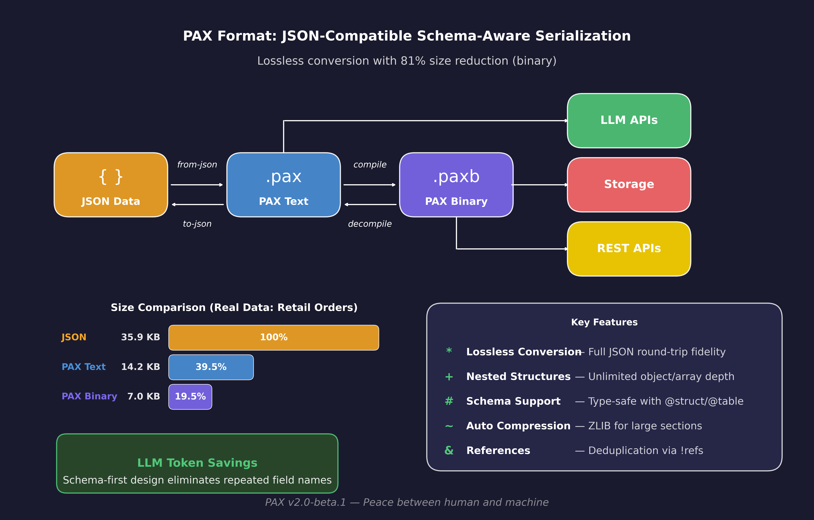

# PAX

***Pax is Latin for peace* [Peace between human and machine.]**

A schema-aware document format with human-readable text and compact binary representation.




---

## Table of Contents

- [Overview](#overview)  
  - [Motivation](#motivation)
  - [File Extensions](#file-extensions)
  - [Quick Compare: JSON vs PAX](#quick-compare-json-vs-pax)
  - [Workflow Real Example](#workflow-real-example)
- [CLI](#cli)
- [Language Bindings](#language-bindings)
- [Design Rationale](#design-rationale)
- [Comparison](#comparison)
  - [When to Use PAX](#when-to-use-pax)
  - [When NOT to Use PAX](#when-not-to-use-pax)
  - [Size Comparison](#size-comparison)
- [Use Cases](#use-cases)
- [Specification](#specification)

---

## Overview

Pax is a data format that combines:
- **Human-readable text** (`.pax`) for editing and version control
- **Compact binary** (`.paxb`) for storage and transmission
- **Inline schemas** for validation and compression
- **JSON interoperability** for easy integration


### Motivation

PAX emerged from practical experience with large-scale data and systems engineering. The existing landscape presented trade-offs that didn't align well with modern workflows:

| Format | Limitation |
|--------|------------|
| JSON | Verbose, no comments, no schema |
| YAML | Indentation-sensitive, error-prone at scale |
| Protobuf | Schema external, binary-only, requires codegen |
| Avro | Schema embedded but not human-readable |
| CSV/TSV | Too simple for nested or typed data |
| MessagePack/CBOR | Compact but schemaless |

Converting some formats to binary yielded marginal benefits. Schema information was almost always external, requiring coordination between files.

PAX was designed to unify these concerns: a single file that humans can read and edit, that compiles to an efficient binary, with schemas inline rather than external. The primary use case is **context engineering** for LLM applications—structured prompts, tool definitions, conversation history—but the format is general-purpose.

### Quick Compare: JSON vs PAX

The same data — PAX uses **schemas** so field names are defined once, not repeated per record:

<table>
<tr>
<th>JSON (no schema, names repeated)</th>
<th>PAX (schema-first, compact data)</th>
</tr>
<tr>
<td valign="top">

```json
{
  "employees": [
    {
      "id": 1,
      "name": "Alice",
      "role": "Engineer",
      "department": {
        "name": "Platform",
        "location": {
          "city": "Seattle",
          "country": "USA"
        }
      },
      "skills": ["rust", "python"]
    },
    {
      "id": 2,
      "name": "Bob",
      "role": "Designer",
      "department": {
        "name": "Product",
        "location": {
          "city": "Austin",
          "country": "USA"
        }
      },
      "skills": ["figma", "css"]
    },
    {
      "id": 3,
      "name": "Carol",
      "role": "Manager",
      "department": {
        "name": "Platform",
        "location": {
          "city": "Seattle",
          "country": "USA"
        }
      },
      "skills": ["leadership", "agile"]
    }
  ]
}
```

</td>
<td valign="top">

```pax
# Schema: define structure once
@struct Location (city: string, country: string)
@struct Department (name: string, location: Location)
@struct Employee (
  id: int,
  name: string,
  role: string,
  department: Department,
  skills: []string,
)

# Data: field names not repeated
employees: @table Employee [
  (1, "Alice", "Engineer",
    ("Platform", ("Seattle", "USA")),
    ["rust", "python"])
  (2, "Bob", "Designer",
    ("Product", ("Austin", "USA")),
    ["figma", "css"])
  (3, "Carol", "Manager",
    ("Platform", ("Seattle", "USA")),
    ["leadership", "agile"])
]
```

</td>
</tr>
</table>

**Why This Matters:**

| Aspect | JSON | PAX |
|--------|------|-----|
| Field names | Repeated for every record | Defined once in schema |
| Types | Implicit, inferred at runtime | Explicit in schema, structural checks at parse |
| Binary size | Large (names + values) | Compact (positional data only) |
| 1000 records | ~80KB+ | ~15KB (schema + values) |
| Validation | External tools needed | Field count validation via schema |

The schema approach means:
- **Text format** is human-readable with explicit types
- **Binary format** stores only values (field names in schema table)
- **String deduplication** — "Seattle", "USA", "Platform" stored once, referenced by index

### Workflow Real Example

A complete retail orders dataset demonstrating the full PAX workflow:

```
┌─────────────────────────────────────────────────────────────────────────────┐
│                           RETAIL ORDERS WORKFLOW                            │
├─────────────────────────────────────────────────────────────────────────────┤
│                                                                             │
│   retail_orders.json ──────► retail_orders.pax ──────► retail_orders.paxb   │
│        36.8 KB       from-json     19.6 KB     compile       6.9 KB         │
│                                                                             │
│   • 10 orders            • 11 schemas defined      • 81% size reduction     │
│   • 4 products           • Human-readable          • Ready for storage      │
│   • 3 customers          • Comments & formatting   • Fast transmission      │
│                                                                             │
├─────────────────────────────────────────────────────────────────────────────┤
│                              LLM ANALYSIS                                   │
├─────────────────────────────────────────────────────────────────────────────┤
│                                                                             │
│   test_retail_analysis.ps1                                                  │
│         │                                                                   │
│         ▼                                                                   │
│   Claude API (retail_orders.pax) ──────► responses/retail_analysis.pax      │
│                                                                             │
│   • Sends PAX-formatted order data      • Business intelligence insights    │
│   • Schema-first = fewer tokens         • Revenue analysis                  │
│   • Structured prompts                  • Customer segmentation             │
│                                                                             │
└─────────────────────────────────────────────────────────────────────────────┘
```

**Try it yourself:**

| File | Description |
|------|-------------|
| [`examples/retail_orders.json`](examples/retail_orders.json) | Original JSON (36.8 KB) |
| [`examples/retail_orders.pax`](examples/retail_orders.pax) | PAX text format (19.6 KB) |
| [`examples/retail_orders.paxb`](examples/retail_orders.paxb) | PAX binary (6.9 KB) |
| [`examples/test_retail_analysis.ps1`](examples/test_retail_analysis.ps1) | Send to Claude API |
| [`examples/responses/retail_analysis.pax`](examples/responses/retail_analysis.pax) | Claude's analysis |

---

## CLI

```bash
pax <command> [options]

Commands:
  compile       Convert text to binary
  decompile     Convert binary to text
  info          Show file info
  validate      Validate text syntax
  to-json       Convert Pax text to JSON
  from-json     Convert JSON to Pax text
  paxb-to-json  Convert Pax binary to JSON
  json-to-paxb  Convert JSON to Pax binary
```

Run `pax help <command>` for detailed usage.

---

## Language Bindings

| Language | Type | Package |
|----------|------|---------|
| **Rust** | Native | `pax-core` crate |
| **.NET** | FFI | `Pax` NuGet package |

Both bindings provide:
- Parse text (`.pax`) and read binary (`.paxb`)
- Dynamic key-based value access
- Schema introspection at runtime
- JSON conversion (bidirectional)
- Memory-mapped reading for large files

Community contributions welcome for Python, Java, and other languages.

---

## Design Rationale

PAX combines ideas from several formats: human-readable text like JSON/YAML, schema-embedded binaries like Avro, and positional encoding like Protobuf. The key difference is that PAX keeps schemas inline with data in the text format, making `.pax` files self-documenting and git-friendly.

The binary format (`.paxb`) embeds schemas, enabling readers to decode files without external `.proto` or `.avsc` files. No code generation is required—schemas are discovered at runtime.

| Feature | JSON | Protobuf | Avro | MsgPack | PAX |
|---------|------|----------|------|---------|-----|
| Human-readable data format | ✅ | ⚠️* | ❌ | ❌ | ✅ |
| Compact binary | ❌ | ✅ | ✅ | ✅ | ✅ |
| Schema embedded in binary | ❌ | ❌ | ✅ | ❌ | ✅ |
| No code generation required | ✅ | ❌ | ⚠️** | ✅ | ✅ |
| Comments in source | ❌ | N/A | N/A | ❌ | ✅ |
| Built-in JSON conversion | — | ❌ | ❌ | ❌ | ✅ |
| Built-in compression | ❌ | ❌ | ✅ | ❌ | ✅ |

*Protobuf TextFormat exists but is rarely used. **Avro supports GenericRecord but codegen is typical.

---

## Comparison

### When to Use PAX

| Use Case | Why PAX |
|----------|---------|
| Config files (human-edited + machine-efficient) | Text format with comments, compiles to compact binary |
| Large numeric arrays | 6-7x smaller than JSON with compression |
| LLM context serialization | Schema eliminates repeated field names |
| Game save files, asset manifests | Self-describing, no external schema files |

### When NOT to Use PAX

| Requirement | Use Instead |
|-------------|-------------|
| Streaming / append-only | JSON Lines, Protobuf + gRPC |
| Schema evolution at scale | Protobuf (field numbers), Avro |
| Maximum decode speed | Bincode, Protobuf, FlatBuffers |
| Tiny payloads (< 100 bytes) | MessagePack, CBOR |
| Database features (queries, indexes, ACID) | A database |

### Size Comparison

*Data from `cargo run --example size_report` on pax-core.*

| Format | Small Object | 10K Points | 1K Users |
|--------|--------------|------------|----------|
| JSON | 1.00x | 1.00x | 1.00x |
| Protobuf | 0.38x | 0.65x | 0.41x |
| MessagePack | 0.35x | 0.63x | 0.38x |
| **Pax Compressed** | 3.56x | **0.15x** | 0.47x |

PAX has 64-byte header overhead (bad for small objects). For large arrays with compression, PAX achieves **6-7x better compression** than JSON.

**Trade-off:** PAX decode is ~2-5x slower than Protobuf due to dynamic key-based access. Choose PAX when size matters more than decode speed.

---

## Use Cases

### Context Engineering (LLM/AI)

Pax is well-suited for assembling and managing context for large language models:

```pax
@struct Message (role: string, content: string, tokens: int?)
@struct Tool (name: string, description: string, params: []string)

system_prompt: "You are a helpful assistant."

tools: @table Tool [
  ("search", "Search the web", ["query"]),
]

history: @table Message [
  ("user", "Hello", 2),
  ("assistant", "Hi there!", 3),
]
```

**Why PAX for LLM context:**
- Schema eliminates repeated field names → fewer tokens
- Binary format for fast cached context retrieval
- String deduplication (roles, tool names stored once)
- Human-readable text for prompt authoring

**Example: 50 messages + 10 tools** — JSON ~15KB vs PAX Binary ~4KB

### Other Use Cases

- **Configuration files** — Human-editable text, compile to binary for deployment
- **Game save data** — Compact binary with nested structs
- **API data exchange** — Bidirectional JSON conversion
- **Scientific/tabular data** — Null bitmap optimization for sparse data
- **Embedded/IoT** — Memory-mapped reads, no parsing allocations

---

## Specification

For the complete technical specification including text format syntax, type system, binary format details, and grammar, see:

**[spec/PAX_SPEC.md](spec/PAX_SPEC.md)**

---

*PAX v2.0.0-beta.1 — Peace between human and machine.*
